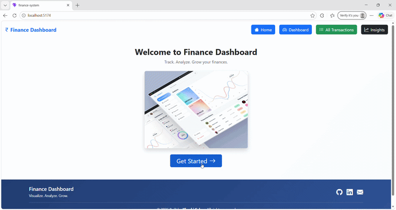
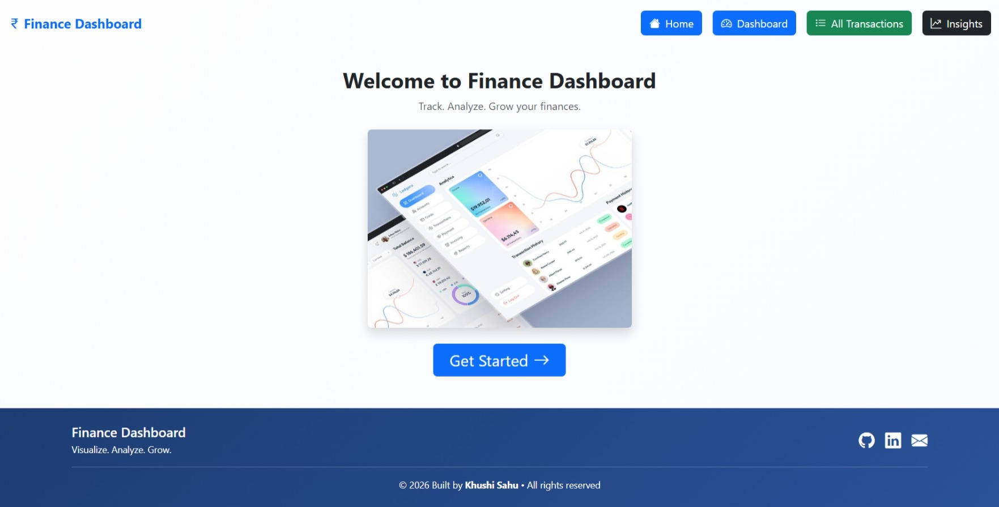
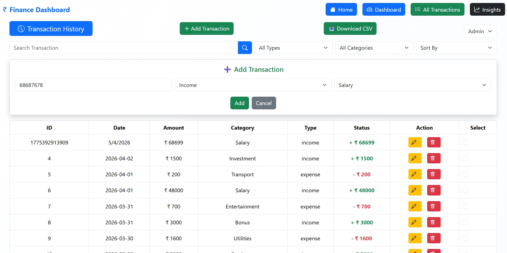
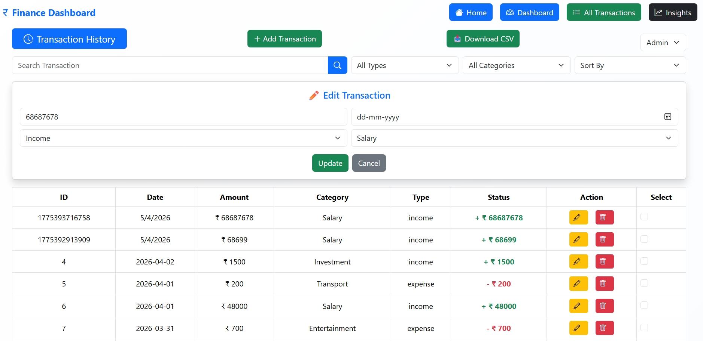
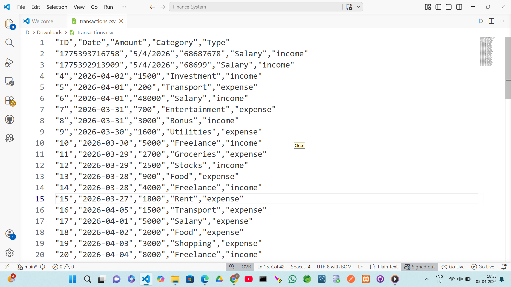
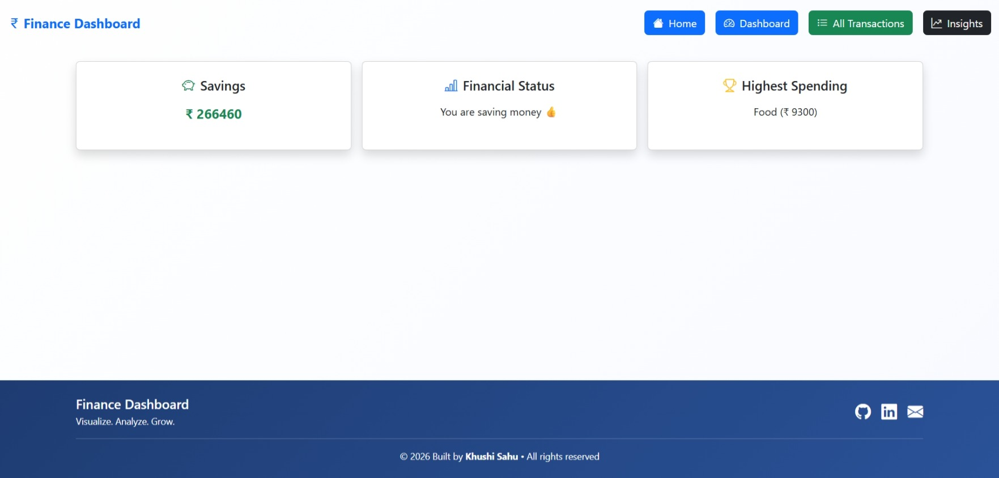

# 🚀 Finance Dashboard UI — Interactive Data Visualization Platform

A modern, responsive, and interactive **Finance Dashboard** built to visualize financial activity, analyze spending patterns, and manage transactions efficiently.

This project was developed as part of a Frontend Developer Internship assessment to demonstrate strong frontend engineering skills, UI/UX thinking, and data-driven design.

---

## 🚀 Live Demo

🔗 **Live Site:** https://your-username.github.io/zorvyn-finance-dashboard/
🌐 Deployed using **Versel**

🎥 **Demo Preview:**


---

## 🎯 Project Highlights

* 📊 Real-time financial overview with clean UI
* 🔍 Advanced transaction exploration (search + filter)
* 👥 Role-based UI simulation (Admin / Viewer)
* 📈 Insightful analytics & data interpretation
* 📱 Fully responsive design (mobile + desktop)

---

## 🖼️ Screenshots

### 📊 Home Page




### 📊 Dashboard Overview


### 📋 Transactions Table






### 📈 Downloaded CSV File



### 📈 Insights & Analytics



---

## ⚡ Features

### 📊 Dashboard Overview

* Total Balance, Income, Expenses cards
* 📈 Time-based visualization (balance trends)
* 🥧 Category-wise expense breakdown

---

### 📋 Transactions Management

* View structured transaction data:

  * Date, Amount, Category, Type
* 🔍 Smart search functionality
* 🎯 Dynamic filtering (Income / Expense / Category)
* 🔽 Sorting (Amount)

---

### 👥 Role-Based UI (Frontend Simulation)

* **Viewer Mode:** Read-only dashboard access
* **Admin Mode:** Add/Edit/Delete/Read transactions enabled
* 🔄 Seamless role switching (dropdown toggle)

---

### 📈 Insights & Analytics

* Highest spending category detection
* Monthly expense comparison
* Data-driven observations using calculated metrics

---

## 🧠 Key Learnings & Concepts

* Component-driven architecture in React
* Efficient state management using hooks
* Data transformation and UI synchronization
* Building scalable and reusable UI components
* Designing intuitive and user-friendly dashboards
* Handling edge cases (empty state, no data scenarios)

---

## 🛠️ Tech Stack

| Technology             | Purpose            |
| ---------------------- | ------------------ |
| ⚛️ React.js            | Frontend Framework |
| 🎨 Bootstrap           | Styling            |
| 📊 Recharts / Chart.js | Data Visualization |
| 🔄 React Router        | Navigation         |
| 📁 Mock JSON           | Data Handling      |

---

## 📂 Project Architecture

```
project-root/
 ├── public/
 ├── src/
 │    ├── components/
 │           ├── Dashboard.jsx
 │           ├── Footer.jsx
 │           ├── insights.jsx
 │           ├── Linechart.jsx
 │           ├── Piechart.jsx
 │           ├── Transaction.jsx
 ├── screenshots/  
 │     ├── home.jpeg
 │     ├── dashboard.jpeg
 │     ├── add-transaction.jpeg
 │     ├── edit-transaction.jpeg
 │     ├── insights.jpeg
 │     ├── csv-file.png
 │     ├── demo.gif
 ├── package.json
 ├── README.md
```

---

## ⚙️ Installation Guide

```bash
git clone https://github.com/khushi-66/zorvyn-finance-dashboard.git
cd zorvyn-finance-dashboard
npm install
npm start
```

---

## 🌟 Advanced Enhancements


* 💾 LocalStorage persistence
* 📊 Interactive charts with animations
* 📤 Data export (CSV/JSON)
* 🎯 Improved filtering & grouping

---

## 🔗 Source Code

👉 https://github.com/khushi-66/zorvyn-finance-dashboard

---

## 🧪 Testing & Edge Cases

* Handles empty transaction states
* Validates user interactions in UI
* Ensures responsive layout across devices

---

## 📝 Recruiter Note

This project reflects my ability to:

* Build clean, scalable frontend architectures
* Design intuitive user interfaces with real-world usability
* Handle application state effectively
* Translate data into meaningful visual insights

I focused on clarity, usability, and maintainable code rather than unnecessary complexity — aligning with real-world frontend development practices.

---

## 👩‍💻 Author

**Khushi Sahu**
Frontend Developer Intern Candidate

---

## ⭐ If you like this project

Give it a ⭐ on GitHub and feel free to connect!


The React Compiler is not enabled on this template because of its impact on dev & build performances. To add it, see [this documentation](https://react.dev/learn/react-compiler/installation).

## Expanding the ESLint configuration

If you are developing a production application, we recommend using TypeScript with type-aware lint rules enabled. Check out the [TS template](https://github.com/vitejs/vite/tree/main/packages/create-vite/template-react-ts) for information on how to integrate TypeScript and [`typescript-eslint`](https://typescript-eslint.io) in your project.
