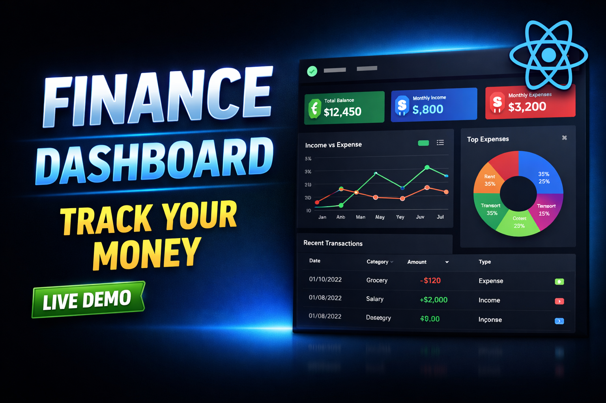
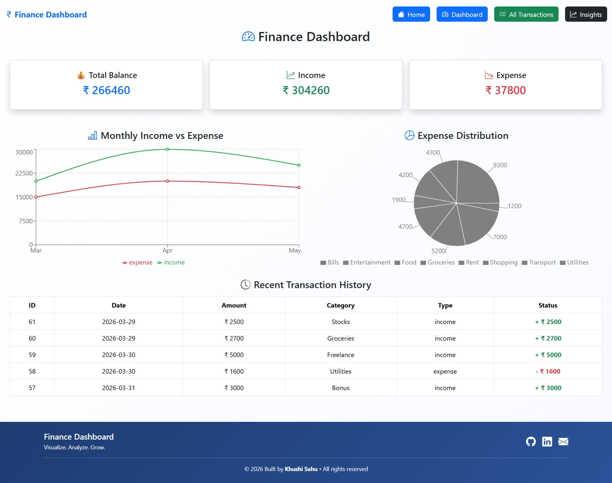
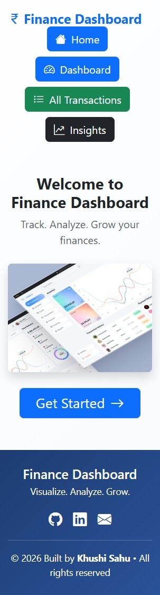

# 🚀 Finance Dashboard UI — Interactive Data Visualization Platform



A modern, responsive, and interactive **Finance Dashboard** built to visualize financial activity, analyze spending patterns, and manage transactions efficiently.

This project was developed as part of a Frontend Developer Internship assessment to demonstrate strong frontend engineering skills, UI/UX thinking, and data-driven design.

🔗 Live Demo: https://finance-khushi.vercel.app

📂 Source Code: https://github.com/khushi-66/finance-management-system

🌐 Deployment: Deployed on Vercel

Youtube Demo: https://youtu.be/HC_lWV7HnTg

---

## 🎥 Demo Preview


---

## 📌 Overview

A modern and fully responsive **Finance Management System** built using React that helps users efficiently manage their income and expenses.

This project demonstrates real-world frontend development skills including **state management, data visualization, filtering, and role-based UI handling**.

---

## ✨ Key Highlights

* 📊 Clean and modern dashboard UI
* 📱 Fully responsive (mobile + desktop)
* ⚡ Real-time data updates
* 👥 Role-based UI (Admin / Viewer)
* 📈 Data-driven insights and analytics
* 📤 Export transactions as CSV

---

## ⚙️ Features

### 📊 Dashboard

* 💰 Total Balance calculation
* 📈 Total Income & Expense tracking
* 📉 Dynamic financial summary cards
* 📊 Monthly Income vs Expense Line Chart
* 🥧 Category-wise Expense Pie Chart

---

### 📋 Transaction Management

* ➕ Add new transactions
* ✏️ Edit existing transactions
* 🗑️ Delete transactions
* 🗑️ Multiple delete (bulk selection)
* 📂 Data persisted using LocalStorage

---

### 🔍 Search, Filter & Sort

* 🔎 Smart search (category, type, amount)
* 🎯 Filter by:

  * Income / Expense
  * Category
* 🔽 Sort transactions:

  * Amount Low → High
  * Amount High → Low

---

### 👥 Role-Based Access (Frontend Simulation)

* 👀 Viewer Mode:

  * Read-only access
* 🛠️ Admin Mode:

  * Full control (Add/Edit/Delete)
* 🔄 Easy role switching

---

### 📈 Insights & Analytics

* 🏆 Highest spending category detection
* 💸 Expense vs Income comparison
* 💰 Savings calculation
* 📊 Data-driven financial insights

---

### 📤 Export Feature

* 📥 Download transactions as CSV file
* Useful for reporting and external analysis

---

## 🖼️ Screenshots

### 📊 Dashboard



### 📋 Transactions


### ✏️ Edit Transaction


### 📈 Insights


### 📄 CSV Export


### Mobile View



---

## 🛠️ Tech Stack

| Technology      | Purpose            |
| --------------- | ------------------ |
| ⚛️ React.js     | Frontend Framework |
| 🎨 Bootstrap    | UI Styling         |
| 📊 Recharts     | Data Visualization |
| 🔄 React Router | Routing            |
| 💾 LocalStorage | Data Persistence   |

---

## 🧠 Key Learnings

* Component-based architecture in React
* Efficient state management using Hooks
* Data filtering, sorting & transformation
* Building reusable UI components
* Handling real-world UI/UX scenarios
* Implementing role-based UI logic
* Working with charts and data visualization

---

## 📂 Project Structure

```
project-root/
 ├── public/
 ├── src/
 │    ├── components/
 │           ├── Dashboard.jsx
 │           ├── Transaction.jsx
 │           ├── Insights.jsx
 │           ├── Linechart.jsx
 │           ├── Piechart.jsx
 │           ├── Footer.jsx
 ├── screenshots/
 ├── package.json
 ├── README.md
```

---

## ⚙️ Installation & Setup

```bash
git clone https://github.com/khushi-66/khushi-66/finance-management-system.git
cd finance-management-system
npm install
npm run dev
```

---

## 🧪 Testing & Edge Cases

* Handles empty transaction state
* Prevents UI crashes on no data
* Responsive across all devices
* Works with dynamic data updates

---

## 🌟 Advanced Features

* 💾 LocalStorage persistence
* 📊 Interactive charts
* 📤 CSV export
* 🔍 Advanced filtering & sorting
* 👥 Role-based UI simulation

---

## 📝 Recruiter Note

This project demonstrates my ability to:

* Build scalable and maintainable frontend applications
* Design clean and intuitive user interfaces
* Implement real-world features like CRUD, filtering, and analytics
* Work with data visualization and insights
* Focus on performance, usability, and clean code practices

I have focused on **clarity, usability, and real-world relevance**, which are essential in modern frontend development.

---

## 👩‍💻 Author

**Khushi Sahu**
Frontend Developer (Fresher)

---

## ⭐ Support

If you like this project, give it a ⭐ on GitHub
and feel free to connect 🚀
pt-eslint.io) in your project.